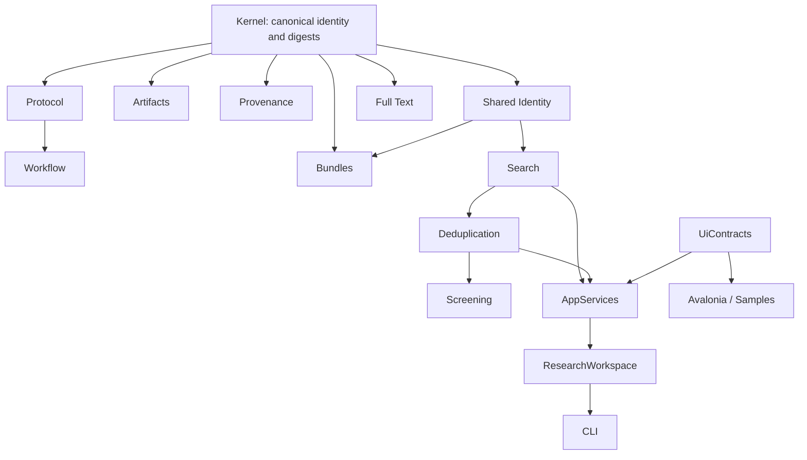

# `core-csharp` full technical review

## Executive verdict

Feature expansion should remain frozen. The next development phase must be integrity hardening.

`core-csharp` is a strong, unusually well-documented early-alpha contract prototype. It has good module boundaries, conservative claim limits, dense tests, deterministic intentions, and a credible local-first architecture. It is not yet an audit-grade scientific authority because several authority-bearing paths accept fabricated or inconsistent state, canonical digests are not actually RFC 8785-compatible, ordinary imports can be misparsed, and workspace generations are neither authenticated nor transactional.

Current verified baseline:

- Fresh clone: [core-csharp-independent-review-2026-07-10](</C:/Users/mouadh/Documents/AI in research/core-csharp-independent-review-2026-07-10/README.md:1>)
- Commit: `7f9e2850dc312cb0b8e8ac0007421937bf5fad1c`
- `origin/main`: same commit on 2026-07-11
- Full repository gate rerun: passed
- Tests: 419 passed, zero failed, zero skipped
- Build: zero warnings, zero errors
- Formatting and CLI smoke checks: passed
- Worktree: clean

The Nexus multi-repository workflow influenced the status classification below: local C# behavior is separated from legacy PHP behavior, and “implemented locally” is not treated as “PHP compatible.”

This dependency graph explains why the Kernel canonicalization defect must be fixed first: it can change Protocol, Workflow, Provenance and Bundle identities downstream.

## Progress classification

| Classification | Modules |
|---|---|
| Implemented locally but currently blocked for authority use | Kernel, Shared, Provenance, Screening, ResearchWorkspace |
| Substantial implementation requiring hardening | Protocol, Workflow, Artifacts, Bundles, Search, Deduplication, FullText, AppServices, CLI |
| Sound projection/prototype layer | UiContracts, Avalonia Blocks |
| Scaffold only | Extensibility, AI |
| Delivery state | Green engineering repository, not release-managed |

## Foundation modules

### 1. `NexusScholar.Kernel`

Maturity: blocked for authoritative scientific digests.

Strengths:

- Injected clocks and ID generators.
- Typed SHA-256 algorithms and digest scopes.
- NFC normalization, deterministic property ordering and immutable canonical trees.
- UTC timestamp and NDJSON rules.
- Non-finite numbers and lone Unicode surrogates are rejected.

Critical defect:

The implementation identifies itself as `rfc8785-jcs`, but number rendering does not follow RFC 8785. JSON parsing prefers `decimal`, while double rendering delegates to `Utf8JsonWriter` and only normalizes exponent spelling in [CanonicalJson.cs:80](</C:/Users/mouadh/Documents/AI in research/core-csharp-independent-review-2026-07-10/src/NexusScholar.Kernel/CanonicalJson.cs:80>) and [CanonicalJson.cs:161](</C:/Users/mouadh/Documents/AI in research/core-csharp-independent-review-2026-07-10/src/NexusScholar.Kernel/CanonicalJson.cs:161>).

Reproduced differences include:

- `1e-6` instead of JCS `0.000001`
- `1e+20` instead of JCS `100000000000000000000`
- Parsed `333333333.33333329` instead of binary64 canonical `333333333.3333333`

What should be done:

1. Adopt a verified RFC 8785 implementation or implement the complete ECMAScript number algorithm.
2. Run the official JCS vectors through direct construction and parse/recanonicalize paths.
3. Decide whether the corrected behavior requires a new canonicalization profile or schema version.
4. Regenerate downstream fixtures only after migration semantics are documented.
5. Add a validated digest-envelope rehydrator that recomputes the digest and validates scope/schema/profile.
6. Reject `Guid.Empty` and default invalid digest/value-object states.

### 2. `NexusScholar.Protocol`

Maturity: substantial local implementation, but authority-safe construction is incomplete.

Strengths:

- Strong draft, decision, approval, amendment, waiver and deviation vocabulary.
- Main factory paths enforce human decisions and dual-independent approval.
- Candidate content digests detect draft changes.
- Protocol content is deeply copied and canonicalized.
- Good positive and negative fixtures.

Problems:

- The public `ProtocolVersion` constructor can fabricate an approved version using caller-provided status, digest and approval IDs at [ProtocolModels.cs:534](</C:/Users/mouadh/Documents/AI in research/core-csharp-independent-review-2026-07-10/src/NexusScholar.Protocol/ProtocolModels.cs:534>).
- `WithApprovals` promotes a version without independently validating approval target, policy or digest.
- Method-pack approval policy is not bound to the selected template. A caller can choose a weaker policy.
- The convenience approval path chooses single-researcher approval.
- Waivers carry approval ID strings but do not resolve or validate the referenced approvals.
- Required decision definitions are not checked for duplicate keys, and recorded decisions are not fully validated against declared value schemas.
- Amendment approval remains mostly record scaffolding.

What should be done:

1. Make direct authority-bearing constructors internal or explicitly non-authoritative.
2. Introduce validated rehydration that recomputes content digests and resolves approval records.
3. Bind the required approval policy to the template/method-pack.
4. Remove or tightly restrict automatic single-researcher approval.
5. Validate declared decision keys and value schemas.
6. Implement real waiver, amendment and deviation approval transitions.

### 3. `NexusScholar.Workflow`

Maturity: strong deterministic compiler, incomplete authority binding.

Strengths:

- Deterministic graph compilation and IDs.
- Rejects draft/stale protocols, duplicate nodes, missing dependencies, cycles and invalid gates.
- Automation and hybrid-workflow boundaries are explicit.
- Scientific inputs cannot be injected through ordinary parameters.

Problems:

- Amendment binding begins by matching amendment ID rather than proving its full protocol/version/digest lineage at [Workflow.cs:465](</C:/Users/mouadh/Documents/AI in research/core-csharp-independent-review-2026-07-10/src/NexusScholar.Workflow/Workflow.cs:465>).
- Caller-supplied invalidation notices can replace amendment notices.
- Affected-artifact checks hash declarations, not the actual produced artifact identity.
- Waiver checks count approval IDs without resolving approval records, roles, actors or target digests.
- Protocol-decision source binding hashes the key and value separately rather than binding the complete decision record.
- Compiled list properties can still expose mutable arrays through public record surfaces.

What should be done:

1. Verify complete amendment lineage and exact invalidation-notice membership.
2. Feed actual produced artifact IDs and digests into invalidation planning.
3. Resolve waiver approvals against an authoritative approval repository.
4. Bind workflow inputs to complete source-record digests.
5. Make compiled workflow definitions deeply immutable.
6. Split the 1,500-line implementation into validation, compilation, binding and invalidation components.

### 4. `NexusScholar.Artifacts`

Maturity: partial and largely unintegrated.

Strengths:

- Good logical-path rules.
- Rejects traversal, URI, drive-letter, absolute and dot-segment paths.
- Rejects negative sizes.
- Computes exact-byte SHA-256 identities.

Problems:

- Functional code does not use `ArtifactDescriptor`; Bundles defines a second artifact contract.
- This duplicates logical-path, digest and provenance semantics.
- Direct constructor validation is weaker than the factory and can fail badly on default digest values.
- Provenance ID/digest pairs are not required to be complete.
- There are no dedicated behavior tests for this module.

What should be done:

1. Establish one shared artifact value object.
2. Make Bundles and Full Text reuse the shared logical-path type.
3. Add validated artifact rehydration and paired provenance-field rules.
4. Add direct artifact fixtures covering invalid default digests, paths, sizes and provenance relationships.
5. Keep storage and filesystem adapters out of the domain module.

### 5. `NexusScholar.Provenance`

Maturity: good factory behavior, unsafe append boundary.

Strengths:

- Factory-created events use injected clocks and IDs.
- Canonical event digest covers documented content.
- Inputs and outputs are defensively copied.
- Store snapshots are immutable.
- Duplicate IDs and several forbidden evidence shapes are tested.

Critical problem:

A caller can directly construct a `ResearchEvent` with an arbitrary digest and invalid actor/entity content at [ProvenanceEvent.cs:176](</C:/Users/mouadh/Documents/AI in research/core-csharp-independent-review-2026-07-10/src/NexusScholar.Provenance/ProvenanceEvent.cs:176>). The in-memory store checks only duplicate event ID before accepting it.

What should be done:

1. Make raw event construction internal or explicitly unverified.
2. Recompute and compare the event digest at `Append`.
3. Rerun actor, activity, entity and binding invariants at the append boundary.
4. Validate agent kinds and nonblank IDs.
5. Add forged-event, wrong-digest, invalid-binding and concurrent-append tests before persistence work.

### 6. `NexusScholar.Bundles`

Maturity: useful manifest verifier, not yet a secure portable importer.

Strengths:

- Deterministic manifest ordering.
- Exact artifact checksum and size verification.
- Logical-path and duplicate-path protection.
- Protocol and provenance known-digest checks.
- Stable tamper categories and useful fixtures.

Problems:

- Known protocol authority is represented mainly as version ID → digest, so all protocol identity fields are not independently proven.
- Workflow binding does not resolve the workflow definition and template digests against known records at [BundleVerifier.cs:134](</C:/Users/mouadh/Documents/AI in research/core-csharp-independent-review-2026-07-10/src/NexusScholar.Bundles/BundleVerifier.cs:134>).
- Every artifact schema is not required to appear in the declared required-schema set.
- Destructive-overwrite checks cover artifact paths, not every imported record identity.
- Provenance ID without provenance digest can pass.
- There is no archive parser or atomic importer.

What should be done:

1. Replace digest dictionaries with full Protocol, Workflow, Template and Provenance resolvers.
2. Enforce artifact schema closure.
3. Unify Bundle artifacts with `NexusScholar.Artifacts`.
4. Require complete provenance binding pairs.
5. Build an importer as a separate staged adapter: validate everything, normalize safe destinations, then commit once.
6. Do not call the current module a full import/export implementation.

## Scholarly workflow modules

### 7. `NexusScholar.Shared`

Maturity: strong identity contract with one P1 invariant failure.

Strengths:

- Good namespace allowlist and normalization.
- Stable identifier overlap rather than title or runtime-object identity.
- No-ID works remain unresolved and require source context.
- Title lookup does not create scientific equality.

Critical problem:

`CorpusSlice.WithWork` merges into the first overlap and immediately returns at [SharedIdentity.cs:365](</C:/Users/mouadh/Documents/AI in research/core-csharp-independent-review-2026-07-10/src/NexusScholar.Shared/SharedIdentity.cs:365>).

A bridge record containing identifiers from two existing works can leave two corpus members sharing the same stable identifier.

What should be done:

1. Merge the full overlap-connected component, not the first match.
2. Add permutation/property tests for bridge records and repeated additions.
3. Enforce the invariant that no two validated members share a stable identifier.
4. Provide an explicit validator for rehydrated corpus slices.

### 8. `NexusScholar.Search`

Maturity: stub-provider trace contract is relatively mature; import parsing is early alpha.

Strengths:

- Search preserves raw duplicate sightings.
- Search does not silently perform Deduplication.
- Provider attempts and partial failures are represented.
- Cache identity is deterministic and provider-order-insensitive.
- Exact source-file bytes are digest-bound.
- Source-specific IDs are preserved without becoming canonical work IDs.

Critical parser problems:

- RIS author `Smith, John` is split into two authors at [SearchImportService.cs:815](</C:/Users/mouadh/Documents/AI in research/core-csharp-independent-review-2026-07-10/src/NexusScholar.Search/SearchImportService.cs:815>).
- Quoted multiline CSV records are split by physical line at [SearchImportService.cs:483](</C:/Users/mouadh/Documents/AI in research/core-csharp-independent-review-2026-07-10/src/NexusScholar.Search/SearchImportService.cs:483>).
- BibTeX parsing is regex/line based and cannot reliably handle common nested or multiline forms.
- Warning evidence can be duplicated.
- Mixed-type schema arrays silently drop non-string elements.

What should be done:

1. Replace hand-written import parsing with standards-aware libraries or properly bounded state machines.
2. Add realistic RIS, multiline CSV and nested/multiline BibTeX fixtures.
3. Add BOM, encoding, quoted-newline and malformed-recovery cases.
4. Create one warning identity model so warnings are not duplicated across trace and record projections.
5. Reject wrong JSON types instead of silently filtering them.
6. Define provider-adapter exception behavior before introducing live providers.

Live providers, API credentials and PHP parity remain deferred; they are not current defects.

### 9. `NexusScholar.Deduplication`

Maturity: exact clustering is good; representative construction is incomplete.

Strengths:

- Exact-ID clustering is transitive.
- Fuzzy-title matches remain human-review evidence.
- Source traces, file digests, raw-record digests and pair evidence are preserved.
- Deterministic tie-breaking exists.

Problems:

- Imported authors, year, venue, abstract and keywords are discarded at [DeduplicationService.cs:329](</C:/Users/mouadh/Documents/AI in research/core-csharp-independent-review-2026-07-10/src/NexusScholar.Deduplication/DeduplicationService.cs:329>).
- Representative completeness therefore measures mostly identifier count, contrary to ADR 0012.
- Missing representative fields are not filled from other cluster members.
- `NaN` can pass fuzzy-threshold validation.
- Rehydrated result DTOs can be fabricated without invariant validation.

What should be done:

1. Extend candidates and representatives with accepted scholarly metadata.
2. Define explicit deterministic completeness weights.
3. Fill missing representative fields without overwriting stronger values.
4. Reject every non-finite threshold and score with `double.IsFinite`.
5. Validate unique candidate IDs, evidence endpoints and cluster membership during rehydration.
6. Add fixtures where representative selection depends on metadata completeness.

### 10. `NexusScholar.Screening`

Maturity: conceptually strong, authority-unsafe.

Strengths:

- Suggestions are separate from final decisions.
- Automation is rejected from normal finalization paths.
- Criteria digests are recomputed.
- Decisions are append-only within the session.
- Disagreements and adjudication are modeled.

Critical problems:

- A public `ScreeningActor` constructor permits a blank human ID at [ScreeningModels.cs:119](</C:/Users/mouadh/Documents/AI in research/core-csharp-independent-review-2026-07-10/src/NexusScholar.Screening/ScreeningModels.cs:119>).
- `NaN` confidence passes ordinary range comparisons.
- Protocol approval is represented by caller-provided strings rather than a verified `ProtocolVersion`.
- Candidate-set locking is a Boolean assertion rather than a verified snapshot/digest binding.
- Full-text evidence accepts digest-shaped strings without resolving actual artifact or extraction evidence.
- Conflict identity becomes inconsistent when source decisions change, and later disagreement can be suppressed after an earlier resolution.

What should be done:

1. Introduce validated `HumanActorId` and finite `Confidence` value objects.
2. Bind Screening criteria to an actual verified Protocol approval record.
3. Require a digest-bound candidate-set snapshot or verified Dedup result.
4. Replace string evidence refs with typed, resolved references.
5. Rebuild conflicts from append-only decisions using either immutable conflict versions or a stable key plus generation ID.
6. Add post-adjudication disagreement tests.

Do not use this module to issue real final scientific decisions before those changes.

### 11. `NexusScholar.FullText`

Maturity: useful no-network contract prototype; incomplete cross-record authority.

Strengths:

- Exact bytes, sizes and raw digests are checked on the main factory path.
- PDF signatures, XML safety, HTML rejection, media type and maximum size are validated.
- Duplicate artifacts are detected by raw digest.
- Extraction remains derived evidence tied to source artifact ID and digest.

Problems:

- `FullTextInput` does not strictly allowlist source kinds and eligibility values.
- Public artifact construction can bypass byte verification and accept mismatched candidates, negative sizes and inconsistent acquisition records.
- Even `FromBytes` does not prove the acquisition belongs to the supplied input.
- Acquisition status is not tightly derived from attempt history.
- Logical paths do not reuse the ADR 0009 path validator.
- Extracted-text representation scope remains underspecified.

What should be done:

1. Make authority constructors private/internal and add explicit validated rehydration.
2. Validate the complete chain from Screening/candidate set through acquisition, attempts and artifact.
3. Require input/candidate/acquisition equality across linked records.
4. Enforce state-machine rules for acquisition outcomes.
5. Reuse the shared logical-path type.
6. Define one explicit extracted-text representation per record.

Live retrieval, provider SDKs, OCR and actual PDF text extraction remain deferred.

## Application and projection modules

### 12. `NexusScholar.Extensibility`

Maturity: Gate 10 scaffold only.

It currently defines a small capability vocabulary and manifest shape. Public constructors can bypass factory validation, and no trust, grant, denial, isolation or runtime model exists.

What should be done:

1. Keep it non-executable.
2. Mark it clearly as scaffold and non-packable.
3. Accept a Gate 10 ADR covering trust, lifecycle, isolation and out-of-process execution.
4. Separate requested, granted and denied capabilities.
5. Add deny-by-default and capability-escalation tests before implementing a loader.

### 13. `NexusScholar.AI`

Maturity: preliminary vocabulary, not governed AI.

The factory correctly demands human approval for higher-authority task categories, but proposal acceptance is not digest-bound, actors can be invalid, and no provenance event is created.

What should be done:

1. Do not add model/provider calls yet.
2. First repair Kernel, Provenance and Screening authority.
3. Accept a Gate 11 ADR for model identity, context manifests, evidence, retention, evaluation and data egress.
4. Make acceptance require a validated human actor, exact proposal digest, policy version and rationale.
5. Append an actual provenance event.
6. Remove the unused Provenance dependency until it is used.

### 14. `NexusScholar.AppServices`

Maturity: useful read-only APP-01 projection, not integrity-bound.

Strengths:

- Deterministic ordering.
- Explicit `AppProjection` source kind.
- Merge actions remain placeholders.
- UI payloads are renderer-neutral.

Problems:

- Warning aggregation double-counts some notices at [SearchDedupWorkspacePlanComposer.cs:273](</C:/Users/mouadh/Documents/AI in research/core-csharp-independent-review-2026-07-10/src/NexusScholar.AppServices/SearchDedupWorkspacePlanComposer.cs:273>).
- Dedup evidence references carry result ID without result digest.
- Duplicate candidate IDs are silently collapsed.
- Slug-generated block/action IDs can collide.
- Plans are not bound to an exact input generation.

What should be done:

1. Deduplicate warnings using a stable warning identity.
2. Add a projection envelope containing workspace ID, input-set digest, trace digests, dedup-result digest and composer version.
3. Reject duplicate IDs.
4. Use canonical identifier plus digest suffix for block/action IDs.
5. Keep the module strictly non-authoritative.

### 15. `NexusScholar.ResearchWorkspace`

Maturity: good service boundary, unsafe workspace store.

This is one of the highest-risk modules.

Confirmed problems:

- Project validation checks only a few top-level fields at [ResearchWorkspaceStore.cs:43](</C:/Users/mouadh/Documents/AI in research/core-csharp-independent-review-2026-07-10/src/NexusScholar.ResearchWorkspace/ResearchWorkspaceStore.cs:43>).
- Null input elements, duplicate IDs, malformed timestamps and invalid digests survive loading.
- Writes are direct, multi-file and non-transactional.
- Concurrent imports lose updates.
- Failed analysis can create mixed generations.
- Import traces are checked for existence, not parsed or hashed.
- Junctions can escape lexical workspace containment.
- Stale or foreign dedup/plan outputs are accepted as current.
- Workspace state becomes review-ready from output existence rather than verified generation identity.

What should be done:

1. Define a strict versioned project schema and validate every field.
2. Add a generation manifest binding workspace ID, project revision, ordered input digests, trace digests and every output digest.
3. Stage the complete generation in a temporary directory.
4. Atomically promote one complete generation.
5. Use file locking or compare-and-swap for project updates.
6. Resolve reparse points and reject junction escapes.
7. Quarantine stale, foreign and corrupt outputs.
8. Add concurrent-import, crash/partial-write, malformed-project, stale-output, corrupt-trace and junction tests.

### 16. `NexusScholar.Cli`

Maturity: coherent local alpha, not yet a robust thin adapter.

Strengths:

- Understandable command loop.
- Stable exit-code vocabulary.
- No network behavior.
- Strong non-claim messaging.
- Useful deterministic demo fixtures.

Problems:

- Import copies bytes before parsing and project commit, leaving orphan files after failure.
- Import uses unlocked read-modify-write.
- Analyze still duplicates write/orchestration behavior that belongs in ResearchWorkspace.
- Status and verify disagree about skipped-record validity.
- Review and cluster commands trust stale plans.
- There is no top-level sanitized exception boundary.
- Malformed project state can escape with stack traces and absolute paths.

What should be done:

1. Move all mutation into transactional ResearchWorkspace use cases.
2. Make CLI commands formatting-only adapters.
3. Add a sanitized top-level error boundary and opt-in debug diagnostics.
4. Define one warning/skipped-record policy.
5. Refuse review/cluster commands when the current generation is unverified.
6. Add multi-process and interrupted-write tests.

### 17. `NexusScholar.UiContracts`

Maturity: sound renderer-neutral DTO layer; not a persisted interchange contract.

Strengths:

- No Avalonia dependency.
- Defensive list copies and null-element rejection.
- Required strings and JSON object payloads are validated.

Problems:

- `WorkspacePlan` has no schema/version or input-generation binding.
- Unique block/action IDs and cross-references are not validated.
- Destructive actions can be constructed without confirmation requirements.
- Evidence digests are arbitrary strings.
- Deserialization is permissive toward unknown fields.

What should be done:

1. Introduce a versioned plan envelope.
2. Use strict deserialization.
3. Validate ID uniqueness, cross-references and action semantics.
4. Use a renderer-neutral typed digest reference.
5. Preserve the UI-framework-free and non-authoritative boundary.

### 18. `NexusScholar.Avalonia.Blocks`

Maturity: useful visual prototype, not a safe command renderer.

Problems:

- Every action becomes an enabled button.
- The supplied callback is invoked without confirmation or lock enforcement.
- Sample/authority classification relies partly on description text.
- Large plans and JSON payloads are eagerly materialized.

What should be done:

1. Add explicit executable/locked state.
2. Disable decision actions unless a host provides an authorized executor.
3. Enforce confirmation for destructive actions.
4. Classify samples through typed source metadata.
5. Add virtualization, payload limits, accessibility and visual-regression tests.

The sample host and Desktop Preview should remain under `samples/`. They are not product UI.

## Repository, CI and delivery

Maturity: strong engineering scaffold, not release-managed.

Current delivery problems:

- README calls the kernel “audit-grade,” which is too strong for the confirmed state.
- `main` remains unprotected as of 2026-07-11.
- Latest Pages deployment still fails.
- Draft PR #23 contains no effective fix.
- All source projects are packable, but there is no LICENSE, versioning policy, release workflow, signing, SBOM or provenance.
- `global.json` allows feature-band SDK drift.
- CI lacks dependency review, CodeQL/SARIF, coverage thresholds, package smoke tests and test-result artifacts.
- Operational docs and the port matrix are stale.
- The security policy requests private contact but supplies no channel.

What should be done:

1. Replace “audit-grade” with “audit-oriented early alpha.”
2. Protect `main` and require PR review plus both OS checks.
3. Set projects `IsPackable=false` until packaging is deliberately designed.
4. Add a license and package/release ADR.
5. Pin SDK and dependency resolution more tightly.
6. Add dependency review, CodeQL, coverage reporting and package validation.
7. Repair Pages and refresh the branch board, merge queue, roster and port matrix.
8. Enable GitHub private vulnerability reporting or publish a concrete security contact.

## Ordered remediation program

### Phase 0 — Freeze and record

- Freeze feature work.
- Open one issue per confirmed blocker.
- Correct the public maturity claim.
- Protect `main`.

Exit condition: every blocker has an owner, test case and dependency order.

### Phase 1 — Canonical foundation

- Correct RFC 8785/JCS behavior.
- Decide digest migration/versioning.
- Add official cross-language vectors.
- Reject invalid default IDs and digests.

Exit condition: official JCS vectors pass through every construction and rehydration path.

### Phase 2 — Authority-safe rehydration

Apply a common pattern to Protocol, Workflow, Provenance, Bundles, Deduplication, Screening and Full Text:

- unverified DTO/parser;
- validated domain factory;
- resolver for referenced records;
- recomputed digest;
- explicit verified result.

Exit condition: no public construction path can create authoritative state without verification.

### Phase 3 — Scholarly pipeline correctness

- Fix Shared transitive closure.
- Replace Search parsers.
- Implement representative metadata.
- Repair Screening bindings and conflicts.
- Close Full Text cross-record validation.

Exit condition: realistic export fixtures and adversarial scientific-state tests pass.

### Phase 4 — Transactional workspace

- Strict project schema.
- Generation manifest.
- Staging and atomic promotion.
- Locking/CAS.
- Safe path resolution.
- Stale-generation rejection.

Exit condition: concurrent and crash-injection tests never produce a valid-looking mixed generation.

### Phase 5 — Test strategy upgrade

Add:

- official canonicalization vectors;
- property-based identity tests;
- parser fuzz and standards fixtures;
- malformed rehydration tests;
- finite-number tests;
- concurrent-process and interrupted-write tests;
- mutation testing for scientific invariants;
- coverage reporting as information, not the sole quality metric.

Exit condition: every previously reproduced defect has a permanent regression test.

### Phase 6 — Release engineering

- Package topology and metadata.
- License and versioning.
- Reproducible restore/build.
- SBOM, signing and provenance.
- Release workflow and package smoke tests.
- Pages recovery and current operational docs.

Exit condition: a tagged artifact can be rebuilt and verified from a clean machine.

### Phase 7 — Compatibility evidence

Only after local correctness:

- Generate fixtures from pinned PHP source.
- Store source commit, generator command/version and input/output digests.
- Implement semantic comparators.
- Classify differences as equivalent, intentional, PHP defect, C# defect or unresolved.

Exit condition: compatibility claims are limited to fixture-backed behaviors.

## Final decision

Use the repository for:

- contract development;
- deterministic local fixtures;
- architecture exploration;
- controlled alpha demonstrations.

Do not yet use it for:

- a real evidence review;
- final scientific decisions;
- published NuGet packages;
- durable workspace storage;
- PHP compatibility claims;
- production desktop workflows.

The architecture is worth preserving. The next work should strengthen the implementation until it meets its own contracts, not add more surface area.

No repository files were modified.